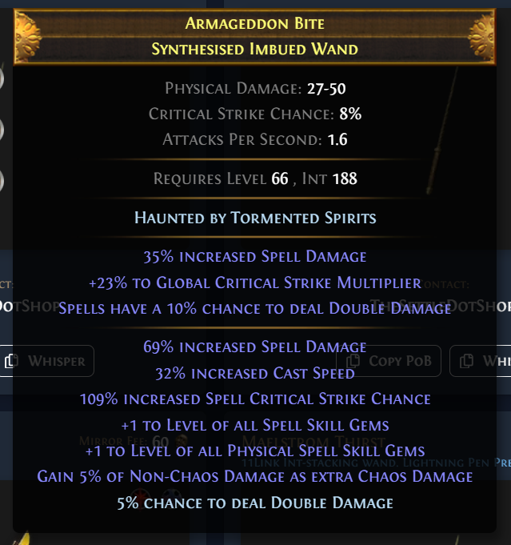

# Path of Exile Item Hover

This repo uses [poe-itemtext-parser](https://github.com/klayveR/poe-itemtext-parser) under the hood to generate the properties needed to display the items.

## Usage

> [!IMPORTANT]
> Make sure to NOT do CTRL - Alt - C as the item parser will not work.

```ts

const exampleItem = `CTRL-C item from in-game`;

import { ItemHover } from 'poe-item-hover';

function MyFancyItem() {
    const [hovered, setHovered] = useState(false);

    return (
        <div 
            onMouseEnter={() => setHovered(true)}
            onMouseLeave={() => setHovered(false)}>
        {hovered && <ItemHover itemData={exampleItem} />}
        </div>
    )
}
```

## Example

This is an example of how the item hover will look like in practice




